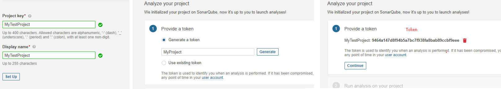
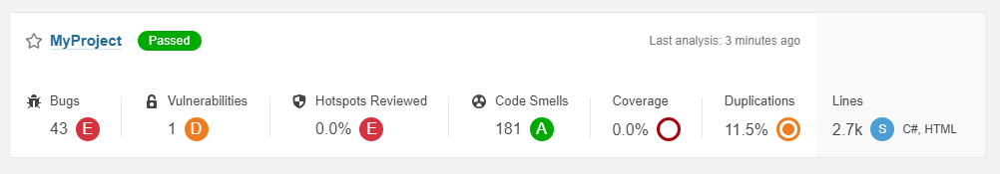

[ERROR]
max virtual memory areas vm.max_map_count [65530] is too low, increase to at least [262144] 

[FIX]  
open powershell 
wsl -d docker-desktop 
sysctl -w vm.max_map_count=262144 
 
restart Docker 
   

  
[INSTALLATION]
<ul>
  <li>dotnet tool install --global dotnet-sonarscanner --version 5.1.0</li>
  <li>dotnet sonarscanner begin /d:sonar.login="9464a147d8f94b5a7bc7f938fa8bab89ccbf9eee" /k:”MyTestProject”</li>
  <li>dotnet build</li>
  <li>dotnet sonarscanner end /d:sonar.login="9464a147d8f94b5a7bc7f938fa8bab89ccbf9eee"</li>
</ul>
  

  
<a href="https://medium.com/@thiagoloureiro/code-analysis-with-sonarqube-docker-net-core-aee521ee8931"> SOURCE</a>
